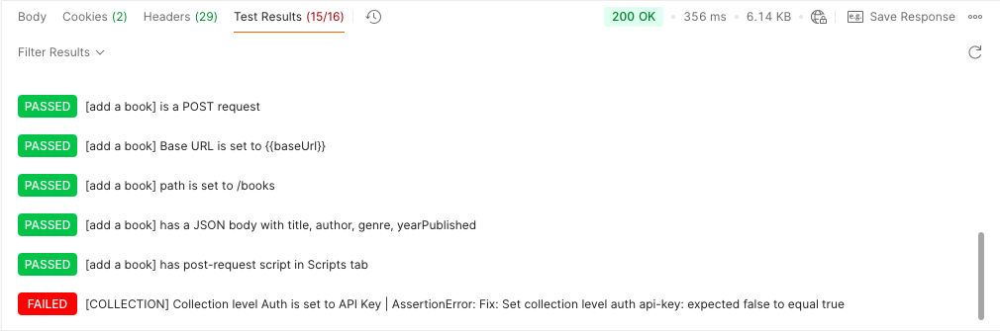
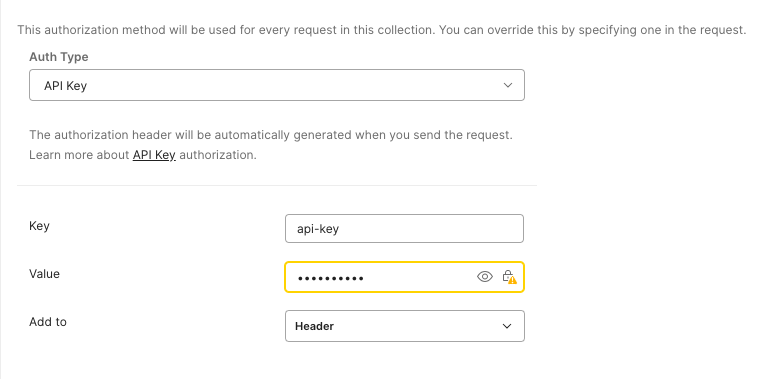
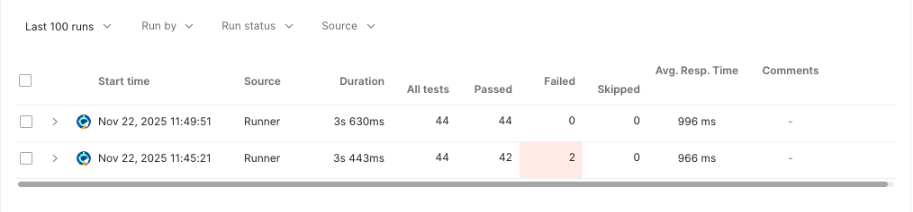

# Troubleshooting: Resolving Collection-Level Authorization Errors in Postman

**Author:** Q<br>
**Date:** November 2025<br>
**Tools:** Postman v11, REST API<br>
**Difficulty:** Beginner

## Overview

While validating the **Postman Library API v2** collection, the automated test suite failed with an assertion error regarding API Key authentication. This guide details the root cause—improper scope configuration—and the steps to resolve it using Collection-Level Authorization.

## The Error

**Scenario:**
Upon running the "Final Check" request, 42/44 tests passed. The specific failure occurred during the authorization validation step.

**Error Message:**

```text
[COLLECTION] Collection level Auth is set to API Key | AssertionError:
Fix: Set collection level auth api-key: expected false to equal true
```




## The Root Cause

The automated test script checks for credentials at the Collection Level (Parent), but the API Key was configured at the Request Level (Child). Furthermore, the Key Name was incorrectly labeled as `student-expert` instead of the required header name `api-key.`

## The Fix

To resolve the `AssertionError`, the authorization must be moved to the Collection level so all requests inherit it automatically.

1. Select the Postman Library API v2 folder in the sidebar.
2. Navigate to the Authorization tab.
3. Set the Type to `API Key.`
4. Configure the credentials:
   - Key: `api-key`
   - Value: `secret_key`
5. Save the changes and re-run the Final Check request.





## Postman API Fundamentals Student Expert Badge

<blockquote
  class="badgr-badge"
  style="font-family: Helvetica, Roboto, 'Segoe UI', Calibri, sans-serif"
>
  <a
    href="https://badges.parchment.com/public/assertions/IZi0yw7eQ0GeDnybEIe8HA"
    ></a>
  <p
    class="badgr-badge-name"
    style="
      hyphens: auto;
      overflow-wrap: break-word;
      word-wrap: break-word;
      margin: 0;
      font-size: 16px;
      font-weight: 600;
      font-style: normal;
      font-stretch: normal;
      line-height: 1.25;
      letter-spacing: normal;
      text-align: left;
      color: #05012c;
    "
  >
    Postman API Fundamentals Student Expert
  </p>
  <p
    class="badgr-badge-date"
    style="
      margin: 0;
      font-size: 12px;
      font-style: normal;
      font-stretch: normal;
      line-height: 1.67;
      letter-spacing: normal;
      text-align: left;
      color: #555555;
    "
  >
    <strong
      style="
        font-size: 12px;
        font-weight: bold;
        font-style: normal;
        font-stretch: normal;
        line-height: 1.67;
        letter-spacing: normal;
        text-align: left;
        color: #000;
      "
      >Awarded: </strong
    >November 2025
  </p>
  <p style="margin: 16px 0; padding: 0">
    <a
      class="badgr-badge-verify"
      target="_blank"
      href="https://badgecheck.io?url=https%3A%2F%2Fbadges.parchment.com%2Fpublic%2Fassertions%2FIZi0yw7eQ0GeDnybEIe8HA"
      style="
        box-sizing: content-box;
        display: flex;
        align-items: center;
        justify-content: center;
        margin: 0;
        font-size: 14px;
        font-weight: bold;
        width: 48px;
        height: 16px;
        border-radius: 4px;
        border: solid 1px black;
        text-decoration: none;
        padding: 6px 16px;
        margin: 16px 0;
        color: black;
      "
      aria-label="Verify (opens in new window)"
      >VERIFY</a
    >
  </p>
</blockquote>
